# Taki Web PyDemo

Demo project for portfolio.

## About

### Authentication

The session mechanism is used as the main method (+ fixation), more about the realization in [[docs/auth/sessions.md]].

> **Why not JWT?**
> Easier management, there is no condition on the client. About security is written in the implementation dock. The current implementation is no worse than JWT.

## TODO

- [ ] Authentication
- [ ] CRUD operations
- [ ] ? Forms
- [ ] exception handling
- [ ] Logging
- [ ] ORM skills
- [ ] noSQL skills
- [ ] RESTful API
- [ ] reusable packages
- [ ] DB Schema
- [ ] NGROK
- [ ] Webhooks
- [ ] Pyment & Billing
  - https://developers.google.com/actions-center/verticals/ordering/e2e/integration-steps/build-feeds/overview
  - https://developer.squareup.com/docs/devtools/sandbox/testing
- [ ] work with litestar repositories
- [ ] Mediator from wsdk
- [ ] coverage, 

### Messenger

- Connection transport: websocket;
- real time data exchange
- private / gropus chats
- persistance layer as postgres (? - sqlite for development)
- "readed" status
- rest api for history
- jwt for identifications

### Registry

- [ ] CircuitBreaker

`value_objects` - неизменяемый объект
`repositories` - неизменяемая коллекция объектов

# Schema

```mermaid
  flowchart TD
    Client["Client/Consumer"]:::client

    subgraph "API Layer"
        API1["Health Endpoints"]:::api
        API2["Health Routers"]:::api
        API3["Other API Routes"]:::api
    end

    subgraph "Server / ASGI Layer"
        SV1["Server Bootstrap (__main__)"]:::server
        SV2["ASGI Application"]:::server
        SV3["Server Configurations"]:::server
        SV4["OpenAPI Configuration"]:::server
        SV5["Server Plugins (Users)"]:::server
        SV6["Server Signals"]:::server
    end

    subgraph "Domain / Business Logic"
        DM1["User DTOs"]:::domain
        DM2["Domain Protocols"]:::domain
        DM3["Repositories Abstractions"]:::domain
        DM4["User Business Logic"]:::domain
    end

    subgraph "Data & Persistence Layer"
        DB1["ORM Models"]:::data
        DB2["Database Migrations"]:::data
        DB3["Data Fixtures"]:::data
    end

    subgraph "CLI and Configuration"
        CL1["CLI Commands"]:::cli
        CL2["CLI Utilities"]:::cli
        CL3["Application Configuration"]:::cli
        CL4["Base Configuration"]:::cli
        CL5["Configuration Constants"]:::cli
    end

    subgraph "External / Reusable Libraries"
        EX1["Binance Integration"]:::external
        EX2["Docs Library"]:::external
        EX3["MWS SDK"]:::external
        EX4["Nexus Integration"]:::external
        EX5["Quiz Functionality"]:::external
    end

    subgraph "Infra & Deployment"
        IN1["Dockerfile"]:::infra
        IN2["Docker Compose"]:::infra
        IN3["Docker Deployment Scripts"]:::infra
        IN4["Makefile"]:::infra
    end

    subgraph "Logging & Utilities"
        LG1["Logger"]:::logging
        LG2["General Utilities"]:::logging
    end

    subgraph "Testing"
        TS1["Test Suites"]:::testing
    end

    %% Flow of requests and orchestration
    Client -->|"HTTP request"| API1
    Client -->|"HTTP request"| API3
    API1 --> SV1
    API2 --> SV1
    API3 --> SV1
    SV1 --> SV2
    SV2 --> SV3
    SV3 --> DM4
    DM4 --> DB1
    DM4 -->|"calls"| EX1
    DM4 -->|"calls"| EX2
    DM4 -->|"calls"| EX3
    DM4 -->|"calls"| EX4
    DM4 -->|"calls"| EX5
    DB2 --> CL1
    SV3 --> LG1

    %% Connect CLI and Configuration to Domain and Data layers
    CL3 --- DM4
    CL4 --- DM4
    CL5 --- DM4
    CL1 --- DB2
    CL2 --- DB3

    %% Styles
    classDef client fill:#5f5845,solid:#050315,stroke-width:2px;
    classDef api fill:#355e71,stroke:#000,stroke-width:2px;
    classDef server fill:,stroke:#000,stroke-width:2px;
    classDef domain fill:#762e67,stroke:#000,stroke-width:2px;
    classDef data fill:#c05e59,stroke:#000,stroke-width:2px;
    classDef cli fill:#273388,stroke:#000,stroke-width:2px;
    classDef external fill:#4e5ae0,stroke:#000,stroke-width:2px;
    classDef infra fill:#6c2e2f,stroke:#000,stroke-width:2px;
    classDef logging fill:#1f757f,stroke:#000,stroke-width:2px;
    classDef testing fill:#6c2e2f,stroke:#000,stroke-width:2px;

    %% Click Events for API Layer
    click API1 "https://github.com/takimoysha/taki-webpydemo/blob/main/src/app/api/health/handlers.py"
    click API2 "https://github.com/takimoysha/taki-webpydemo/blob/main/src/app/api/health/routers.py"
    click API3 "https://github.com/takimoysha/taki-webpydemo/blob/main/src/app/api/routers.py"

    %% Click Events for Server / ASGI Layer
    click SV1 "https://github.com/takimoysha/taki-webpydemo/blob/main/src/app/__main__.py"
    click SV2 "https://github.com/takimoysha/taki-webpydemo/blob/main/src/app/asgi.py"
    click SV3 "https://github.com/takimoysha/taki-webpydemo/blob/main/src/app/server/server.py"
    click SV4 "https://github.com/takimoysha/taki-webpydemo/blob/main/src/app/server/openapi.py"
    click SV5 "https://github.com/takimoysha/taki-webpydemo/blob/main/src/app/server/plugins/users.py"
    click SV6 "https://github.com/takimoysha/taki-webpydemo/blob/main/src/app/server/signals.py"

    %% Click Events for Domain / Business Logic
    click DM1 "https://github.com/takimoysha/taki-webpydemo/blob/main/src/app/domain/dto/users.py"
    click DM2 "https://github.com/takimoysha/taki-webpydemo/blob/main/src/app/domain/protocols.py"
    click DM3 "https://github.com/takimoysha/taki-webpydemo/blob/main/src/app/domain/repositories/__init__.py"
    click DM4 "https://github.com/takimoysha/taki-webpydemo/blob/main/src/app/domain/services/users.py"

    %% Click Events for Data & Persistence Layer
    click DB1 "https://github.com/takimoysha/taki-webpydemo/blob/main/src/app/db/models/users.py"
    click DB2 "https://github.com/takimoysha/taki-webpydemo/tree/main/src/app/db/migrations"
    click DB3 "https://github.com/takimoysha/taki-webpydemo/tree/main/src/app/db/fixtures"

    %% Click Events for CLI and Configuration
    click CL1 "https://github.com/takimoysha/taki-webpydemo/blob/main/src/app/cli/commands.py"
    click CL2 "https://github.com/takimoysha/taki-webpydemo/blob/main/src/app/cli/utils.py"
    click CL3 "https://github.com/takimoysha/taki-webpydemo/blob/main/src/app/config/app.py"
    click CL4 "https://github.com/takimoysha/taki-webpydemo/blob/main/src/app/config/base.py"
    click CL5 "https://github.com/takimoysha/taki-webpydemo/blob/main/src/app/config/consts.py"

    %% Click Events for External / Reusable Libraries
    click EX1 "https://github.com/takimoysha/taki-webpydemo/tree/main/src/binance_lib"
    click EX2 "https://github.com/takimoysha/taki-webpydemo/tree/main/src/docs_lib"
    click EX3 "https://github.com/takimoysha/taki-webpydemo/tree/main/src/mws_sdk"
    click EX4 "https://github.com/takimoysha/taki-webpydemo/tree/main/src/nexus_lib"
    click EX5 "https://github.com/takimoysha/taki-webpydemo/tree/main/src/quiz"

    %% Click Events for Infrastructure & Deployment
    click IN1 "https://github.com/takimoysha/taki-webpydemo/tree/main/dockerfile"
    click IN2 "https://github.com/takimoysha/taki-webpydemo/blob/main/docker-compose.yml"
    click IN3 "https://github.com/takimoysha/taki-webpydemo/tree/main/deploy/docker"
    click IN4 "https://github.com/takimoysha/taki-webpydemo/tree/main/makefile"

    %% Click Events for Logging & Utilities
    click LG1 "https://github.com/takimoysha/taki-webpydemo/blob/main/src/app/lib/logger.py"
    click LG2 "https://github.com/takimoysha/taki-webpydemo/blob/main/src/app/lib/utils.py"

    %% Click Event for Testing
    click TS1 "https://github.com/takimoysha/taki-webpydemo/tree/main/tests"
```

# References & Links

1. [Session Management Cheat Sheet / cheatsheetseries.owasp.org](https://cheatsheetseries.owasp.org/cheatsheets/Session_Management_Cheat_Sheet.html)
2. [Python monorepo: an example / tweag.io](https://www.tweag.io/blog/2023-04-04-python-monorepo-1/)
3. 
